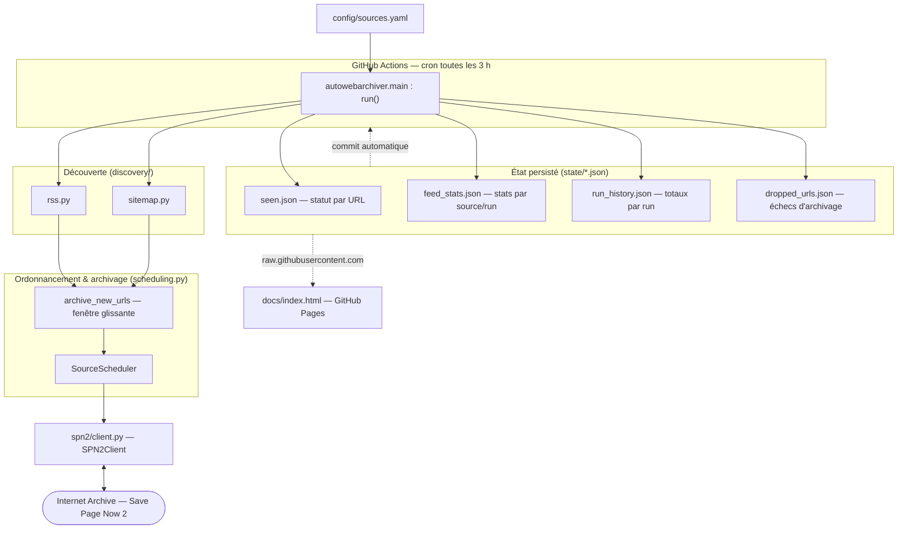

# AutoWebArchiver

Archivage automatique de pages web sur l'[Internet Archive](https://web.archive.org/).

Surveille une liste de sites (flux RSS ou sitemap XML, voir [`config/sources.yaml`](config/sources.yaml)),
détecte les nouveaux articles, et déclenche leur archivage via l'API [Save Page Now 2](https://web.archive.org/save).
Conçu pour tourner périodiquement via [GitHub Actions](.github/workflows/archive.yml).

📊 [**Page de statistiques et de monitoring**](https://armanddelessert.github.io/AutoWebArchiver/) — état des sources,
tendances (succès/erreurs/429), backlog restant.

## Installation locale

```bash
pip install -e . -r requirements-dev.txt
cp .env.example .env  # renseigner ARCHIVE_ORG_ACCESS_KEY / ARCHIVE_ORG_SECRET_KEY
                      # (clés gratuites sur https://archive.org/account/s3.php)
```

## Exécution

```bash
python -m autowebarchiver.main
```

## Tests

```bash
pytest
```

## Architecture

Le projet est un pipeline **sans serveur ni base de données** : un unique script Python (`autowebarchiver.main`)
tourne périodiquement, lit/écrit son état dans des fichiers JSON versionnés dans le dépôt, et une page statique
lit ces mêmes fichiers pour le monitoring. Il n'y a aucune infrastructure à héberger — GitHub Actions fournit le
déclencheur périodique, le dépôt Git sert de stockage d'état, et GitHub Pages sert le tableau de bord.



### Déroulé d'une exécution

`run()` ([`main.py`](src/autowebarchiver/main.py)) orchestre chaque exécution en cinq temps :

1. **Reprise** — `poll_leftovers()` interroge Internet Archive pour résoudre les captures laissées « en attente »
   (`pending`) par l'exécution précédente.
2. **Découverte** — pour chaque source, `discover_rss` / `discover_sitemap` récupèrent la liste courante des URLs.
   `FeedStatsStore.record()` la compare à l'instantané précédent : il en déduit les nouveaux articles et, pour les
   sources rotatives, ceux qui ont **disparu du flux sans confirmation d'archivage** (les « échecs d'archivage »).
3. **Archivage** — `archive_new_urls()` soumet les nouvelles URLs à SPN2 selon une fenêtre glissante (voir plus bas).
4. **Persistance** — les quatre magasins d'état sont purgés (rétention `state_max_age_days`) puis réécrits sur disque.
5. **Résumé** — un enregistrement agrégé est ajouté à `run_history.json`.

### Modules

| Module | Rôle |
| --- | --- |
| [`main.py`](src/autowebarchiver/main.py) | Point d'entrée et orchestration (`run()`) — enchaîne découverte, archivage et persistance. |
| [`config.py`](src/autowebarchiver/config.py) | Chargement et **validation stricte** de `sources.yaml` (`Source`, `Settings`) avec messages d'erreur explicites. |
| [`discovery/`](src/autowebarchiver/discovery) | Extraction des URLs : `rss.py` (via `feedparser`), `sitemap.py` (via `lxml`, suit les index sur un niveau). Modèle commun `DiscoveredItem`. |
| [`scheduling.py`](src/autowebarchiver/scheduling.py) | Cœur de l'ordonnancement : `SourceScheduler` (équité entre sources), `archive_new_urls` (boucle submit/poll), `poll_leftovers`. |
| [`spn2/`](src/autowebarchiver/spn2) | Client de l'API Save Page Now 2 : `client.py` (soumission, polling, limitation de débit, retries avec backoff), `models.py` (interprétation des réponses, statuts non-réessayables). |
| [`state/`](src/autowebarchiver/state) | Les quatre magasins d'état persistés en JSON (voir ci-dessous) + `normalize_url` (déduplication : retire les paramètres de tracking et le fragment). |
| [`logging_setup.py`](src/autowebarchiver/logging_setup.py) | Configuration du logging. |

### État persisté

L'« état » du système tient dans quatre fichiers JSON sous [`state/`](state), committés dans le dépôt à chaque
exécution. Ils jouent le rôle qu'aurait une base de données, mais restent lisibles, diffables et servis tels quels
au tableau de bord.

| Fichier | Contenu | Écrit par |
| --- | --- | --- |
| `seen.json` | Le **quoi a été fait**, indexé par URL : un statut par URL *effectivement soumise* (`pending` → `success` / `already_archived` / `error_retry` / `error`), le nombre de tentatives et le `spn2_job_id`. C'est la source de vérité qui évite de re-soumettre une URL déjà traitée. | `SeenStore` |
| `feed_stats.json` | Statistiques par source et par exécution : taille du flux, nouveaux, sortis du flux, couverture temporelle. Ne stocke **pas** la liste des URLs individuelles (pour rester petit). | `FeedStatsStore` |
| `run_history.json` | Un enregistrement agrégé par exécution (succès, erreurs, 429, file d'attente reportée…) — alimente les graphiques de tendance. | `RunHistoryStore` |
| `dropped_urls.json` | Un journal des URLs précises dont l'archivage automatique a échoué avant leur sortie du flux. Complémentaire de `seen.json` : les URLs *jamais soumises* (sorties du flux avant qu'on ait pu les tenter) n'apparaissent que là, tandis que celles réellement tentées y figurent **et** dans `seen.json`. | `DroppedUrlsStore` |

### Modèle d'ordonnancement et de débit

L'archivage est **mono-thread** : `archive_new_urls` maintient une fenêtre glissante de captures « en vol »
(`max_concurrent_spn2_jobs`), en soumettant une nouvelle URL dès qu'un créneau se libère et que la limite de débit
locale (`max_captures_per_minute`, 7/min) l'autorise. Le plafond réel de débit étant celui de SPN2, un seul thread
qui alterne soumissions et sondages suffit — ni threads ni `asyncio`.

`SourceScheduler` décide quelle URL passe ensuite, avec deux garanties : chaque source active dispose d'un
**plancher de créneaux** réservés (même une source noyée dans un gros backlog progresse à chaque run), et au-delà de
ce plancher les sources **rotatives** (non exhaustives, à risque de perte) passent avant les sitemaps exhaustifs.
Les égalités sont départagées en tourniquet pour ne pas favoriser en permanence la première source du fichier.

### Orchestration et déploiement

- **[`archive.yml`](.github/workflows/archive.yml)** — déclenche `run()` toutes les 3 h (cron), puis committe et
  pousse les fichiers `state/*.json` mis à jour (avec retry en cas de course sur `main`).
- **[`ci.yml`](.github/workflows/ci.yml)** — lance `ruff`, `mypy` et `pytest` sur chaque push et pull request.
- **Tableau de bord** — [`docs/index.html`](docs/index.html) est une page statique servie par GitHub Pages ; elle
  lit les fichiers `state/*.json` en direct via `raw.githubusercontent.com`, sans backend. Toute la logique
  d'affichage (graphiques, tableaux, vérification manuelle auprès d'Internet Archive) est côté client.

## Sources surveillées

Configurées dans [`config/sources.yaml`](config/sources.yaml) : flux RSS ou sitemap XML, avec un indicateur
`exhaustive` par source (un sitemap qui liste tout l'historique d'un site, sans urgence de capture, vs un flux
qui tourne et dont les anciens articles peuvent disparaître — voir le scheduler dans
[`src/autowebarchiver/main.py`](src/autowebarchiver/main.py)).

| Source | Type | Exhaustif |
| --- | --- | --- |
| [letemps.ch](https://www.letemps.ch/articles.rss) | RSS | non |
| [rts.ch](https://www.rts.ch/info/toute-info/?format=rss/news) | RSS | non |
| [lemonde.fr](https://www.lemonde.fr/sitemap_news.xml) | Sitemap | non |
| [apreslabiere.fr](https://www.apreslabiere.fr/sitemap.xml) | Sitemap | oui |
| [frenchspin.fr](https://frenchspin.fr/wp-sitemap.xml) | Sitemap | oui |
| [le-courrier.ch](https://www.le-courrier.ch/wp-sitemap.xml) | Sitemap | oui |
| [techcafe.fr](https://techcafe.fr/sitemap_index.xml) | Sitemap | oui |

`24heures.ch` a été essayé puis retiré : la découverte des articles fonctionnait, mais toutes les tentatives
de capture échouaient systématiquement (502 *bad gateway*) — le site bloque vraisemblablement les requêtes
en provenance de l'infrastructure d'Internet Archive.
